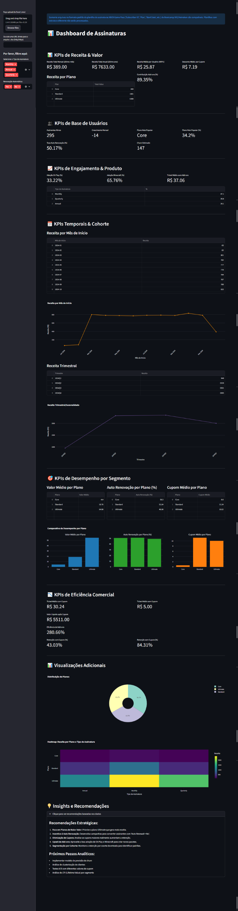

# 🎯 Subscription Analytics Dashboard — Enhanced Edition

[](https://www.python.org/)
[](https://streamlit.io/)
[](LICENSE)

Originally a DIO & Heineken Bootcamp exercise to build a dashboard in Excel, this project evolved into a Python implementation using Streamlit. It offers a responsive interface for subscription data analysis, complete with data loading, validation, KPIs, interactive charts, and clear insights — emphasizing clean design, reliable data processing, and deployability via Docker.

---

📸 Demo screenshot

<p align="center">
  
</p>

---

## 🌟 Key Features

- Robust data ingestion:
  - Upload Excel (.xlsx) via UI or provide a remote URL
  - Automatic validation of required columns and friendly error messages
- Cleaned and safe preprocessing:
  - Date parsing, numeric coercion and graceful handling of missing/invalid entries
  - Period → string conversion to ensure visualization compatibility
- Business KPIs:
  - ARPU, Monthly/Annual revenue, Coupon impact, Add-on contribution, Retention metrics, Churn estimate
- Interactive visualizations:
  - Time series (monthly & quarterly), bar charts, pie charts, heatmap and comparative subplots (Plotly)
  - Responsive layout with Streamlit columns and container widths
- Insights & Recommendations:
  - Built-in strategic recommendations and next analytical steps (churn model, LTV, A/B tests)
- Deploy-ready:
  - Docker support for reproducible local deployment

---

## 🚀 Quickstart (local)

Requirements:
- Python 3.10+ (recommended 3.11)
- Docker (optional — commands below)

1. Clone the repo:
```bash
git clone https://github.com/your-username/dio-heineken-bootcamp-dashboard-excel.git
cd dio-heineken-bootcamp-dashboard-excel
```

2. Create a virtual environment and install dependencies:
```bash
python -m venv .venv
source .venv/bin/activate        # macOS / Linux
.venv\Scripts\activate           # Windows PowerShell
pip install -r requirements.txt
```

3. Provide data:
- Option A: Place `database.xlsx` at the project root (recommended for quick demo).
- Option B: Upload an .xlsx file via the app sidebar.
- Option C: Provide a direct URL to an .xlsx file in the sidebar.

4. Run locally:
```bash
streamlit run app.py
```
Open http://localhost:8501/ in your browser.

---

## 🐳 Docker (one‑liner build & run)

Build the image:
```bash
docker build -t dio-dashboard .
```

Run the container:
```bash
docker run -p 8501:8501 --name dio-heineken-dashboard dio-dashboard
```

Open in browser:
```
http://localhost:8501/
```

---

## 🗂 Data format

The app expects an Excel with these columns (exact names recommended):

- Subscriber ID
- Name
- Plan
- Start Date
- Auto Renewal
- Subscription Price
- Subscription Type
- EA Play Season Pass
- EA Play Season Pass Price
- Minecraft Season Pass
- Minecraft Season Pass Price
- Coupon Value
- Total Value

If your file uses different headers, align them or adapt `clean_col` to map aliases.

---

## 🧰 Structure
```
├─ assets\
│   └─ screencapture-dashboard.png
├─ .gitignore
├─ app.py
├─ ci.yml
├─ config.toml
├─ dashboard-finalizado.xlsx - is included solely for DIO & Heineken Bootcamp exercise.
├─ database.xlsx - source of data.
├─ dockerfile
├─ README.md
├─ requirements.txt
```
---

## ✅ What's been improved (summary)
- Data validation and robust parsing (dates, numerics)
- Period→string conversion to fix serialization errors
- New KPIs and corrected growth logic
- More visualizations: heatmap, comparative subplots, pie charts
- Better UX: clear sidebar upload, info messages and error handling
- Performance: caching of input loads and reuse of computed columns
- Insights section with recommended next steps

---

## 🧪 Tests & Development

- Add pytest tests for critical data transformations (recommended).
- Use `st.cache_data` carefully when testing to avoid stale cache.

---

## 📄 **License**

Licensed under the [MIT License](LICENSE).

---

<p align="center">
  <a href="https://www.linkedin.com/in/pedrosolozabal/">
    
  </a>
</p>